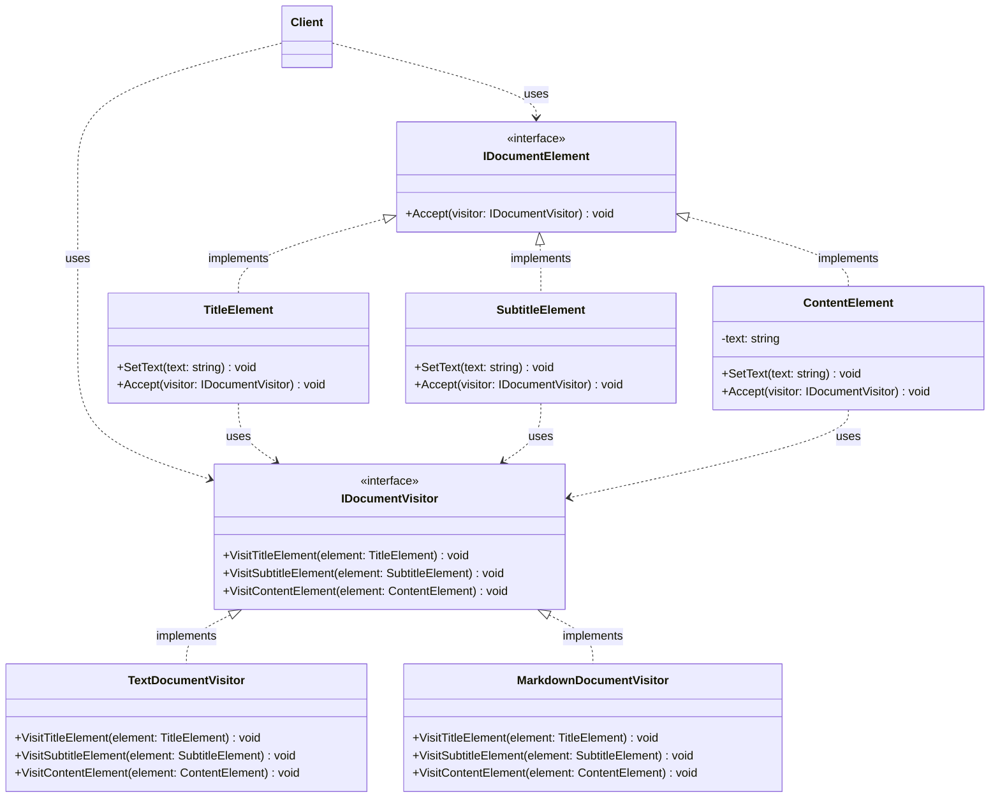

## VISITOR DESIGN PATTERN

### Definition :

Represent an operation to be performed on the elements of an object structure (a group of related objects). 
Visitor lets you define a new operation without changing the classes of the elements on which it operates.

### Visitor Pattern UML Diagram

### Double Dispatch

**Double dispatch** is a mechanism where the exact method executed at runtime depends on the dynamic (actual) types of **two** objects involved in the call, rather than just one. 

Most object-oriented languages (like C#, Java, and TypeScript) natively support only *single dispatch*. This means when you call `obj.Method(argument)`, the runtime decides which version of `Method` to run based solely on the type of `obj`, entirely ignoring the dynamic type of the `argument`. 

The **Visitor Design Pattern** is essentially a clever workaround to achieve double dispatch in single-dispatch languages.

Here is a breakdown of how it works, using the code as our guide.

#### The Two Dispatches

To simulate double dispatch, the Visitor pattern chains two standard single-dispatch calls together. Let's look at the line `element1.Accept(visitor1);` from our code.

*   **Dispatch 1 (The Accept Call):** 
    You declare `Element element1 = new ConcreteElement1();`. When you call `element1.Accept(visitor1)`, the runtime uses single dispatch. It looks at the actual type of the receiver (`element1`) and routes the call to the `Accept` method defined inside the `ConcreteElement1` class.
*   **Dispatch 2 (The Visit Call):** 
    Inside the `ConcreteElement1.Accept` method, the code usually looks exactly like this: `visitor.Visit(this);`. At this point, the compiler knows that `this` is explicitly a `ConcreteElement1`. The runtime looks at the actual type of the receiver again (which is `ConcreteVisitor1`) and routes the call to the overloaded `Visit(ConcreteElement1 element)` method on that specific visitor.

It is a "double" dispatch because the final execution relies on **two** consecutive dynamic method calls to resolve the types of two different objects:

1. **First dispatch (`element.Accept(visitor)`):** The runtime determines the concrete type of the **Element**.
2. **Second dispatch (`visitor.Visit(this)`):** Inside that `Accept` method, the runtime determines the concrete type of the **Visitor**.

The final method executed depends on *both* types, making it a double dispatch.

#### Why Do We Need Double Dispatch?

Without double dispatch, you would be forced to write messy type-checking code to figure out what operation to perform. 

If you just tried to call `visitor1.Visit(element1)` directly, the compiler would only see the abstract `Element` type. It wouldn't know whether to run the logic for `ConcreteElement1` or `ConcreteElement2`, forcing you to write code like:

*   `if (element is ConcreteElement1) { ... }`
*   `else if (element is ConcreteElement2) { ... }`

By using the double dispatch trick (`Accept` calling `Visit`), the types resolve themselves automatically without any `if/else` statements or type casting. 

#### The Ultimate Benefit
Because of this mechanism, you can keep adding entirely new operations (like `ConcreteVisitor3`, `ConcreteVisitor4`) to your application without ever having to modify the existing `Element` classes. 

Are you currently trying to implement a Visitor pattern to traverse that Survey PDF AST from your previous TypeScript example?

### Benefits

* Separation of concerns
* Extensability : Open - Close Principle (OCP)
* In the Visitor we can accumulate the state. As we interate through the 
elements we can accumulate the results of each element and resturn the overall
result in the end or on demand. So, we can build complex result.
* Encapsulation of the Algorithm inside the visitor. The elements can focus on the data,
as the Visitors can focus on the operation.

### Drawbacks

* Tight coupling between the Visitors and the Concrete Elements. Every Visitor needs to know about
every single one of the Concrete Elements. The Visitor needs to know about the specific
methods that each one of the elements has. If something needs to change in the element, all the visitors need
to know how to accomodate this change.
* When we add a new element, we have to update all the Visitors. This Design Pattern is feasible
when the number of Concrete Elements will not grow or change often. If you are going to have many elements in the future,
do not apply this design pattern, as it's going to be complex. You want to apply this design pattern when the situation is
the opposite : the number of elements is limited or not often change and the number of operations increases.
* If you accumulate some state in the Visitor, you might have to be aware of the order, as it can might matter. For a Document,
for example, the elements must be rendered in the right order. So, you end up having an order control mechanism in your client.
* Circular Dependency : Element depends on the => Visitor, which depends on the => Concret Elements. It makes it harder to maintain
and to understand.
* Complexity