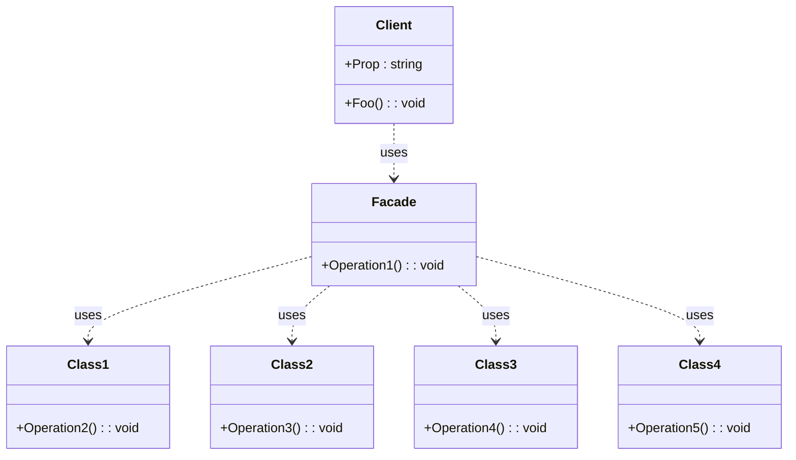

# Facade Design Pattern

## Definition

A unified interface to a set of interfaces in a subsystem. Facade defines a higher-level interface that makes
the susbsystem easier to use"

## Diagram 

## Benefits : 

* Simplification - it's easier for the client to interact with the facade than having to manipulate multiple objects
* Decoupling - the client code is decoupled from the subsystem

## Drawbacks : 

* Facade may be become a God object - you want to make sure that the boundaries of your facade are clear or somewhat clear and
refactor your facade if you see it's becoming too large.
* Reduce the flexibility - the client can only operates with what the Facade exposes to it. It can not manipulate the undelying 
objects as it wants.
* Sometime the Facade abstraction is only a leaky abstraction - in order to operate with some Facade you need to know undelying
implementation. A good example is the Entity Framework Core. It's a Facade above the Database, but int order to use it you end up
needing to know it's underlying details. You need to try as much as possible to avoid the Facade to leak the complexity of the 
underlying system.
* Changes in the subsystem might require the Facade to change as well, violating the Open-Closed Principle (OCP).
* Performance overhead (in most case negligible).